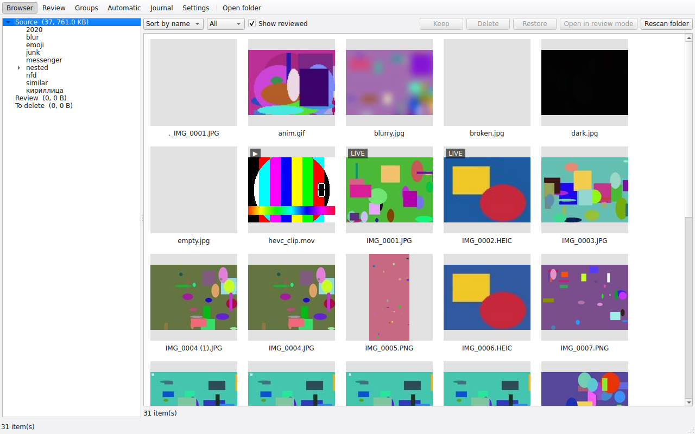

# Framesift

**Разобрать огромный архив фото и видео, ничего не потеряв.**
Framesift — бесплатное десктоп-приложение с открытым кодом (macOS, Windows, Linux) и
консольная утилита для тех сотен гигабайт старых выгрузок с телефона, к которым страшно
подступиться. Оно ничего не удаляет и не меняет само: каждое действие — перемещение, каждое
перемещение записано в журнал, и любое можно отменить.

[English](README.md) · [Архитектура](ARCHITECTURE.md) · [Изменения](CHANGELOG.md)



## Что делает

Вы указываете три папки:

| Папка | Назначение |
|---|---|
| **Источник** | где лежат фото и видео (подпапки — по желанию) |
| **Ревью** | сюда автоматический режим складывает кандидатов в мусор, по категориям |
| **К удалению** | сюда уходит всё, что вы решили удалить, пока не очистите папку |

и работаете в двух режимах:

* **Ручной** — по одному элементу: `→` оставить, `←` на удаление, `↓` решу позже,
  `Ctrl/Cmd+Z` отменить.
* **Автоматический** — локальный анализ находит дубликаты, скриншоты, записи экрана, короткие
  видео, файлы без данных камеры, мусор, размытые и тёмные кадры, серии похожих снимков,
  показывает отчёт (без перемещений) и переносит в папку Ревью только подтверждённые вами
  категории. Дальше вы разбираете их вручную или по группам (дубли и похожие кадры).

Плюс браузер трёх папок, журнал всех перемещений и одна явная кнопка «Очистить К удалению» —
единственное, что вообще удаляет файлы.

Framesift понимает архивы с айфона: HEIC, Live Photos (фото и MOV всегда вместе), файлы
правок `.AAE`, отредактированные копии (`IMG_E1234`), HEVC-видео, а также кириллицу и
NFD/NFC в именах на macOS и SMB-шарах.

## Правила безопасности

* Содержимое файлов не меняется никогда, метаданные не записываются.
* Ничего не перезаписывается: при конфликте имён добавляется суффикс `~2` и запись в журнал.
* Перемещение в пределах тома — переименование (мгновенно, атрибуты сохраняются). Между
  томами — копирование → проверка хеша → только потом удаление исходника.
* Каждое перемещение (ручное или автоматическое) записывается в каталог: откуда, куда, когда,
  почему, какой сессией. Отмена последнего действия, всей сессии, категории или вообще всего —
  в том числе после перезапуска и с другой машины.
* Служебные папки (`@eaDir`, `#recycle`, `.Trashes`, `$RECYCLE.BIN`, …), а также папки Ревью и
  К удалению не сканируются. С библиотеками Apple Photos приложение отказывается работать,
  для каталогов Lightroom показывает предупреждение.
* Удаляет файлы только кнопка **Очистить К удалению**: на локальных дисках — в системную
  корзину, на сетевых томах — с явным предупреждением о безвозвратности (корзина общей папки
  NAS или снапшоты могут ещё хранить данные).

## Установка

Сборки лежат на странице [Releases](https://github.com/henzel/framesift/releases).

* **macOS** (отдельные сборки для Apple Silicon и Intel): откройте `.dmg` и перетащите
  Framesift в Applications. Сборка не подписана, если у мейнтейнера не настроен сертификат
  Apple Developer: при первом запуске нажмите правой кнопкой → **Открыть** → **Открыть**, либо
  один раз выполните `xattr -d com.apple.quarantine /Applications/Framesift.app`.
* **Windows 10/11 x64**: распакуйте архив и запустите `Framesift.exe`. Для неподписанной
  сборки SmartScreen покажет «Система Windows защитила ваш компьютер»: нажмите
  **Подробнее** → **Выполнить в любом случае**. Консольная утилита — `framesift.exe` в той же папке.
* **Linux x64**: `chmod +x Framesift-*.AppImage && ./Framesift-*.AppImage`. CLI:
  `./Framesift-*.AppImage cli …`.
* **Из исходников** (любая ОС с Python 3.12):
  `pip install "framesift[gui] @ git+https://github.com/henzel/framesift"`, затем `framesift-gui`.
  Поставьте `ffmpeg` (превью видео и запасной плеер) и при желании `exiftool` (превью RAW)
  пакетным менеджером; десктоп-сборки уже содержат LGPL-версии.

## Быстрый старт

1. **Настройки** → выберите папку источника. Ревью и К удалению по умолчанию —
   `<Источник>/_framesift_review` и `<Источник>/_framesift_delete` (обе исключены из
   сканирования). Если три папки на разных томах, Framesift предупредит.
2. **Открыть** — папка сканируется в фоне, браузер заполняется по ходу.
3. **Автоматический** → **Запустить анализ** → посмотрите отчёт → снимите галочки с того, с чем
   не согласны, при необходимости подвиньте пороги → **Перенести выбранные категории в Ревью**.
   Кандидаты попадают в `<Ревью>/<категория>/<исходный относительный путь>`, похожие кадры —
   в `<Ревью>/similar/<группа>/`.
4. **Просмотрите** перенесённое (двойной клик в браузере или **Группы** для дублей и похожих
   кадров). `→` возвращает элемент на исходное место, `←` отправляет в К удалению.
5. Когда закончите: **Настройки** → **Очистить К удалению…**. До этого момента всё можно
   отменить на странице **Журнал**.

## Клавиши

Ручной режим:

| Клавиша | Действие |
|---|---|
| `→` | оставить (Источник: пометить «просмотрено» · Ревью/К удалению: вернуть на исходное место) |
| `←` | на удаление (если элемент уже там — ничего) |
| `↓` | пропустить, решу позже |
| `Ctrl+Z` / `⌘Z` | отменить последнее действие (многоуровнево) |
| `Пробел` / `M` | пауза–воспроизведение / звук |
| `Z` | 100 % ↔ по размеру окна; перетаскиванием можно двигать изображение |
| `L` (удерживать) | проиграть видео Live Photo |
| `I` | показать или скрыть панель информации |
| `Esc` | вернуться в браузер |

Режим групп: `←`/`→` выбор кадра, `K` отметка «оставить», `Enter` применить (отмеченные
остаются, остальные уходят в К удалению), `↓` пропустить группу, `Ctrl/Cmd+Z` отмена. Лучший
кадр отмечен заранее.

Браузер: клик, `Shift`, `Ctrl/Cmd`, выделение рамкой; **Оставить**, **На удаление**, **Вернуть
на место** действуют на выделенное; двойной клик или `Enter` открывает ручной режим с этого
элемента с текущими сортировкой и фильтром.

## Категории автоматического режима

| Категория | Уверенность | Правило |
|---|---|---|
| duplicates | высокая | одинаковое содержимое (BLAKE3). Остаётся копия с самым «чистым» именем (без ` (1)`, `copy`, `-1`); при равенстве — более ранняя дата, затем более короткий путь |
| screenshots | высокая | EXIF UserComment `Screenshot`, либо PNG без данных камеры с разрешением экрана телефона |
| screen_recordings | высокая | `RPReplay_Final*`, либо видео без данных камеры с разрешением экрана телефона |
| short_videos | средняя | короче 3 с (настраивается); MOV от Live Photos не считаются |
| no_camera_media | низкая | нет производителя и модели камеры в метаданных — обычно сохранёнки из мессенджеров, но бывают и фото, присланные другими людьми |
| junk | высокая | `.DS_Store`, `._*`, `Thumbs.db`, `desktop.ini`, пустые файлы, файлы, которые не декодируются, «осиротевшие» `.AAE`; опционально все `.AAE` |
| blurry_dark | низкая | очень низкая резкость (дисперсия Лапласиана) или почти чёрный кадр; пороги консервативные |
| similar | средняя | перцептивный хеш в окне ±60 с; остаётся самый резкий (затем самый большой) кадр |

Файл, подходящий под несколько категорий, попадает в первую по этому списку. Ещё три вещи
только показываются в отчёте, без перемещения: MOV от Live Photos (с отдельной кнопкой
«перенести все», после чего фотографии станут статичными), пары оригинал + правка и 100 самых
больших видео с грубой оценкой экономии от пережатия H.264 в HEVC.

## Запуск на NAS (Docker)

Тяжёлую работу — сканирование, хеши, pHash — лучше делать там, где лежат диски. Docker-образ
содержит CLI, ffmpeg/ffprobe (LGPL) и exiftool; работает на `linux/amd64` и `linux/arm64`.
Каталог хранится в `<Ревью>/.framesift/`, поэтому десктоп-приложение на Mac или ПК потом
открывает ту же папку по SMB и продолжает с тем, что посчитал NAS.

**Synology DSM 7 — по SSH:**

```bash
# один раз узнайте uid и gid своего пользователя
id photo-user            # → uid=1026(photo-user) gid=100(users)

docker run --rm -it --user 1026:100 \
  -v /volume1/photo:/data \
  ghcr.io/henzel/framesift:latest \
  scan --source /data/Archive --low-priority

docker run --rm -it --user 1026:100 -v /volume1/photo:/data ghcr.io/henzel/framesift:latest \
  classify --catalog /data/Archive/_framesift_review --low-priority --workers 2
docker run --rm -it --user 1026:100 -v /volume1/photo:/data ghcr.io/henzel/framesift:latest \
  report --catalog /data/Archive/_framesift_review
docker run --rm -it --user 1026:100 -v /volume1/photo:/data ghcr.io/henzel/framesift:latest \
  apply --catalog /data/Archive/_framesift_review            # dry-run
docker run --rm -it --user 1026:100 -v /volume1/photo:/data ghcr.io/henzel/framesift:latest \
  apply --catalog /data/Archive/_framesift_review --yes      # реальное перемещение
```

**Synology DSM 7 — Container Manager (графически):** Container Manager не умеет задавать
пользователя для обычного контейнера, поэтому создайте **Проект** с таким `docker-compose.yml`
(Container Manager → Проект → Создать → вставить):

```yaml
services:
  framesift:
    image: ghcr.io/henzel/framesift:latest
    user: "1026:100"          # ваши uid:gid из вывода `id`
    volumes:
      - /volume1/photo:/data
    command: ["scan", "--source", "/data/Archive", "--low-priority"]
```

Меняйте `command` для каждого шага (`classify`, `report`, `apply --yes`, `undo --all --yes`,
`purge --yes`). Прогресс пишется в `<Ревью>/.framesift/logs/framesift-<дата>.log` (удобно
смотреть через `tail -f`), полные списки — в `<Ревью>/.framesift/reports/`. `--low-priority`
включает `nice`/`ionice`, чтобы NAS оставался отзывчивым; для дополнительного «тормоза» добавьте
`--cpu-shares 256` в `docker run`.

## Командная строка

```
framesift scan     --source DIR [--catalog DIR] [--delete-dir DIR] [--no-recursive] [--workers N] [--low-priority]
framesift classify --catalog DIR [--categories a,b,…] [--short-video-seconds 3] [--similar-window 60]
                   [--similar-distance 6] [--blur-threshold 12] [--dark-threshold 0.03] [--move-all-aae]
framesift report   --catalog DIR [--json] [--out DIR]
framesift apply    --catalog DIR [--categories …] [--live-photos] [--yes]
framesift undo     --catalog DIR (--last | --session ID | --category NAME | --all) [--yes]
framesift purge    --catalog DIR [--yes] [--permanent]
framesift status   --catalog DIR [--json]
```

`apply`, `undo` и `purge` без `--yes` работают как dry-run. Вывод в консоль короткий (итоги и до
пяти примеров на категорию); `--json` даёт машиночитаемую сводку, полные списки всегда пишутся
в CSV/JSON рядом с каталогом. Коды выхода: 0 ок, 1 ошибка, 2 неверные параметры, 3 каталог
занят, 4 отказ (библиотека Apple Photos), 5 завершено с пропущенными файлами.

## Вопросы и ответы

**Что-нибудь отправляется в интернет?** Нет. Всё работает локально, сетевого кода нет.

**Где каталог?** `<Ревью>/.framesift/catalog.db` (SQLite), рядом lock-файл, логи и отчёты.
Превью кэшируются в папке кэша пользователя (по умолчанию 2 ГБ, настраивается), никогда внутри
папок с фото.

**Две машины одновременно?** Пишет только одна: у каталога есть lock-файл с heartbeat. Пока
NAS выполняет задачу, десктоп-приложение открывает каталог только для чтения и показывает
прогресс; устаревший lock от упавшего процесса можно забрать.

**А HEIC?** Декодируется через libheif (`pi-heif`, LGPL), запасной вариант — встроенный
ffmpeg. Метаданные, включая Apple ContentIdentifier для связи Live Photos, читаются прямо из
заголовков файла без декодирования.

**RAW?** Превью DNG работают сразу; для остальных RAW показывается встроенное превью, если
доступен `exiftool` (входит в десктоп-сборки). RAW никогда не попадает в «без данных камеры»
или «мусор» из-за отсутствующих метаданных.

**Почему в группе похожих выбран именно этот кадр?** Побеждает самый резкий (дисперсия
Лапласиана по маленькому превью), затем большее разрешение. В режиме групп это меняется
клавишей `K`.

**Отменить после очистки К удалению?** Очистка — единственная необратимая операция. На
локальном диске файлы в системной корзине; на NAS проверьте корзину общей папки.

**Что-то пропущено.** Файлы, которые не удалось прочитать (права, блокировки, исчезли),
перечислены в отчёте и на странице журнала; работа продолжается.

## Лицензии

Framesift распространяется под лицензией MIT. Десктоп-сборки включают LGPL-компоненты как
отдельные динамические библиотеки (Qt / PySide6, libheif, libde265, FFmpeg) и вызывают ffmpeg,
ffprobe и exiftool как отдельные процессы; см. [THIRD_PARTY_LICENSES.md](THIRD_PARTY_LICENSES.md).

## Участие

См. [CONTRIBUTING.md](CONTRIBUTING.md). Самое полезное в сообщении об ошибке — вывод
`framesift status --json` и несколько строк лога.
